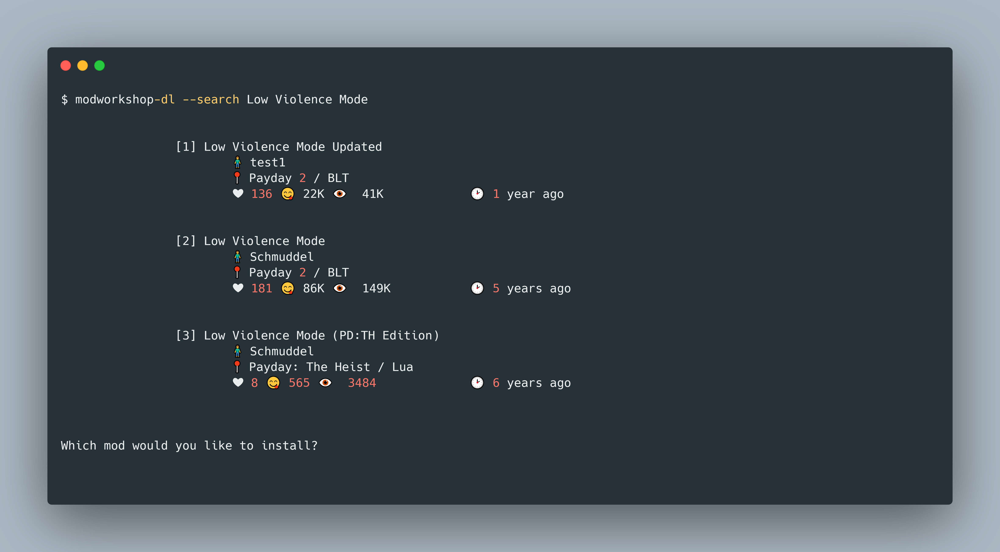

# modworkshop-dl
<p align=center>
  
</p>

## ℹ A Command-Line Utility Tool for Installing Mods from [Mod Workshop](https://modworkshop.net/)

### Get Started
#### Install via Searching
1. Run the tool with the `search` flag followed by your query
```
$ modworkshop-dl --search low violence mode
```
<p align=center>
  
</p>

2. From the list of mods returned, write the index of the mod you would like to download (The mod will now be downloaded into your mods folder)
3. Launch `PAYDAY 2`!
#### Install from Link
1. Run the tool with the `install` flag followed by the link to the mod (The mod will now be downloaded into your mods folder)
```
$ modworkshop-dl --install https://modworkshop.net/mod/25629
```
2. Launch `PAYDAY 2`! 
#### Install from File
1. Create / Open the [`modlist.txt`](https://github.com/WillKirkmanM/modworkshop-dl/blob/main/modlist.txt) file (In the same directory as the executable).
2. Paste the desired mods in the "`Mods`" header
3. Paste the desired assets in the "`Assets`" header
4. Start the tool
```
$ modworkshop-dl --file modlist.txt
```
5. Launch `PAYDAY 2`!

### Examples
Below is an example of the mod list text file that you will be supplied with the `--file` flag. Note that the mods links are under the `Mods` header and the assets links are below the `Assets` header. 
```
# modlist.txt
Mods
https://modworkshop.net/mod/40265
https://modworkshop.net/mod/40992
https://modworkshop.net/mod/41000

Assets
https://modworkshop.net/mod/41001
https://modworkshop.net/mod/40586
```
### Usage
See the usage by running
```
$ modworkshop-dl --help
```
```
Modworkshop-dl allows for installing mods with ease.

usage: modworkshop-dl [<command>] [<argument>]

The following commands are available:
search, S                       The mod to search                               [-S <Name>]
file, f                         The text file containing the mods               [-f <File>]
install, I			            The Link / ModID To Be Installed		        [-I <Link / ModID>]	
```

### Supported Games
| Game    	| Windows 	| Mac 	| Linux 	|
|---------	|---------	|-----	|-------	|
| PAYDAY 2 	| 🟩       	| 🟥   	| 🟥     |

### Building
To build the files run the command:
```
go build
```
If the above does not work try the command:
```
go install
```


  ### How does it work?
  - Web Scraping with [Colly](http://go-colly.org/)
  - Downloading with [Grab](https://github.com/cavaliergopher/grab)
  - Interactive Terminal with [Uilive](https://github.com/gosuri/uilive)
  - Unarchiving .zip / .rar / .tar with [Archiver v3](https://github.com/mholt/archiver)


### What I've Learned
- The "Fundahmentals" of Golang ⏩
- Command Line Tooling (How they are made) 💿
- Web Scraping ✨
- As a person with OCD. Never write all of your code in one file, You'll go Crazy.
